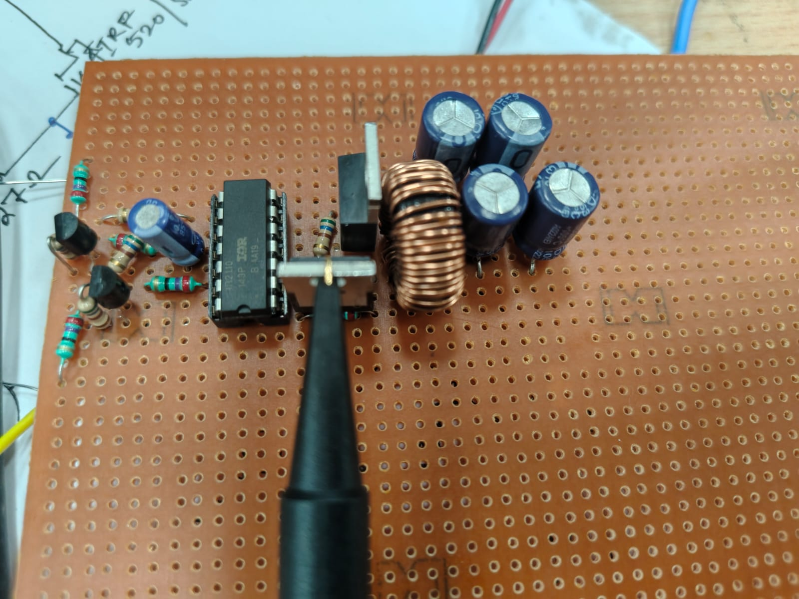
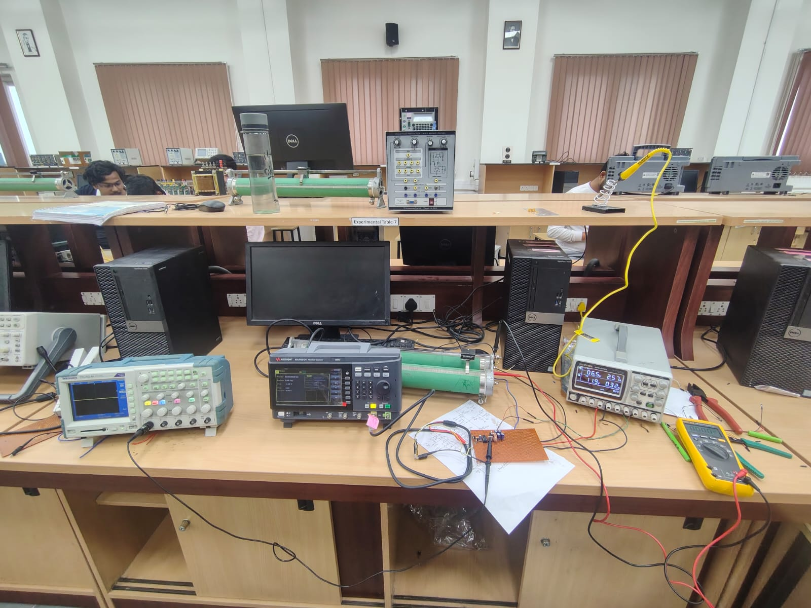
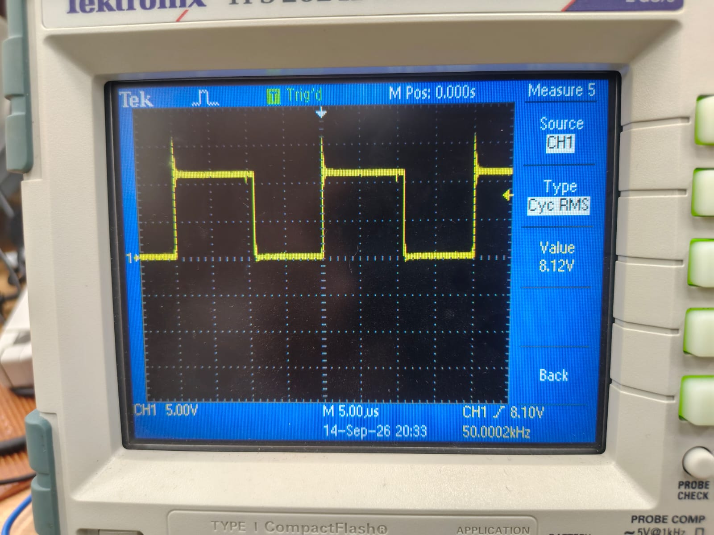
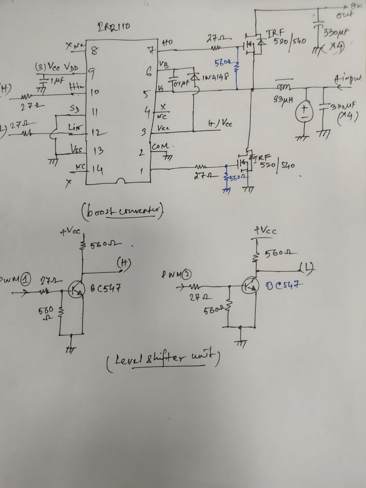

# Synchronous Boost Converter — Hardware Design & Experimental Validation

A discrete **synchronous boost converter** designed, assembled, and experimentally
validated as a laboratory power-electronics prototype.

The project focuses on practical converter design, high/low-side MOSFET gate
driving, bootstrap operation, PWM interfacing, magnetic/filter selection, and
experimental validation with laboratory instrumentation.

> **Project status:** Hardware prototype completed and experimentally tested.
> Some detailed waveforms and efficiency measurements could not be captured
> retrospectively because the hardware is not currently accessible. No
> unmeasured performance numbers are claimed.

---

## 1. Project Overview

The prototype uses a synchronous MOSFET power stage in place of the conventional
boost-diode implementation.

### Experimental operating point

| Parameter | Value |
|---|---:|
| Converter topology | Synchronous Boost |
| Input voltage, \(V_{in}\) | 6 V |
| Output voltage, \(V_{out}\) | ≈ 11 V |
| Switching frequency | ≈ 50 kHz |
| Duty ratio, \(D\) | 0.50 |
| Inductor | 33 µH |
| Output load | 20 Ω |
| Estimated output current | ≈ 0.55 A |
| Estimated output power | ≈ 6.05 W |
| Input current observed on bench supply | ≈ 1 A |
| Gate driver | IR2110 |
| Power MOSFETs | IRF520 / IRF540 (prototype marking) |

The measured 11 V output is close to the ideal CCM boost prediction:

$$
V_o = \frac{V_{in}}{1-D}
$$

$$
V_o = \frac{6}{1-0.5}=12\text{ V}
$$

The difference between the ideal 12 V and measured ≈11 V is consistent with
real converter losses and non-idealities such as MOSFET voltage drop, inductor
resistance, switching/dead-time effects, wiring resistance, and parasitic
elements.

---

## 2. System Architecture

```text
                         +VOUT
                           |
                    Output capacitor
                           |
                           |
                          QH
                           |
                           +--------- SW NODE
                           |
                          QL
                           |
                          GND

VIN -------- L = 33 µH -------- SW NODE
```

The high-side and low-side MOSFETs are driven by an IR2110 gate driver.

```text
PWM 1 ──> BC547 level-shifter ──> IR2110 HO ──> High-side MOSFET

PWM 2 ──> BC547 level-shifter ──> IR2110 LO ──> Low-side MOSFET
```

The high-side driver uses a bootstrap network.

---

## 3. Gate-Driver / Interface Hardware

The prototype includes:

- IR2110 high/low-side gate driver
- Bootstrap capacitor: 10 µF
- Bootstrap diode: 1N4148
- Gate resistors: 27 Ω
- Gate-source pull-down resistors: 560 Ω
- BC547 transistor level-shifter stages
- Local VCC decoupling
- Separate high-side and low-side gate-drive paths

The 27 Ω gate resistors provide a practical trade-off between switching speed,
gate-drive current, and ringing. The 560 Ω resistors provide a defined
gate-to-source discharge path when the driver output is inactive.

---

## 4. Power Stage

### Inductor

$$
L=33\,\mu H
$$

At the 6 V, 50 kHz, 50% duty operating point, the idealized inductor ripple is:

$$
\Delta I_L = \frac{V_{in}D}{Lf_s}
$$

$$
\Delta I_L =
\frac{6(0.5)}
{33\times10^{-6}(50\times10^3)}
\approx 1.82\,A
$$

This relatively high ripple current is an important design consideration for
the selected inductance.

### Output load

With a 20 Ω resistive load and approximately 11 V output:

$$
I_o=\frac{V_o}{R}
=\frac{11}{20}
\approx0.55\,A
$$

$$
P_o=\frac{V_o^2}{R}
=\frac{11^2}{20}
\approx6.05\,W
$$

---

## 5. CCM Check

For an ideal boost converter, the critical inductance is:

$$
L_{crit}=
\frac{D(1-D)^2R}{2f_s}
$$

For:

- \(D=0.5\)
- \(R=20\,\Omega\)
- \(f_s=50\,kHz\)

$$
L_{crit}
=
\frac{0.5(0.5)^2(20)}
{2(50\times10^3)}
=25\,\mu H
$$

Since:

$$
33\,\mu H > 25\,\mu H
$$

the operating point is expected to be in **CCM under the idealized model**.

Actual CCM operation should ultimately be verified from the measured inductor
current waveform.

---

## 6. Experimental Validation

The hardware was tested using:

- Laboratory DC power supply
- Digital oscilloscope
- Digital multimeter
- PWM/function generator
- 20 Ω resistive load

The oscilloscope captured a switching waveform of approximately:

$$
f_s \approx 50.0002\,kHz
$$

The prototype produced approximately 11 V from a 6 V input at a 50% duty ratio.

### Hardware prototype



### Laboratory setup



### PWM waveform



### Hand-drawn circuit



---

## 7. Power and Efficiency

The bench supply indicated an input current of approximately 1 A. Because this
was only observed from the supply display and was not recorded as a precise
measurement, it is **not used to claim a measured efficiency**.

Using the approximate values:

$$
P_{in}\approx6V\times1A=6W
$$

while the output estimate is:

$$
P_o\approx6.05W
$$

This would imply slightly above 100% efficiency, which is physically impossible
for this converter and clearly indicates that the approximate measurements are
not sufficiently accurate or synchronized for an efficiency claim.

**Therefore, measured efficiency is intentionally left unreported.**

A future measurement should record \(V_{in}\), \(I_{in}\), \(V_{out}\), and
\(I_{out}\) simultaneously and calculate:

$$
\eta =
\frac{V_{out}I_{out}}
{V_{in}I_{in}}\times100\%
$$

This is preferable to inventing or back-calculating an efficiency value.

---

## 8. Key Engineering Considerations

The project involved practical analysis of:

- Boost-converter voltage conversion
- CCM/DCM boundary
- Inductor ripple current
- MOSFET conduction and switching losses
- High-side bootstrap gate driving
- Gate resistance and switching speed
- Gate pull-down networks
- Complementary PWM generation
- Dead-time requirements
- Switching-node parasitics
- Output capacitor ripple
- Laboratory measurement limitations

---

## 9. Known Limitations / Future Work

The following measurements were not retained from the original laboratory
session:

- High-side \(V_{GS}\) waveform
- Low-side \(V_{GS}\) waveform
- Switching-node \(V_{SW}\)
- Dead-time measurement
- Inductor-current waveform
- Precise input/output current
- Measured converter efficiency
- Switching transient/ringing characterization

Future work:

1. Capture high-side and low-side gate waveforms simultaneously.
2. Verify dead time at the MOSFET gates.
3. Capture the switching-node waveform with an appropriate probe setup.
4. Measure inductor-current ripple and verify CCM experimentally.
5. Characterize efficiency over load.
6. Optimize gate resistance and dead time.
7. Redesign the power stage on a dedicated PCB with minimized high-current
   loop area and controlled gate-drive return paths.

---

## 10. Repository Structure

```text
synchronous-boost-converter/
├── README.md
├── docs/
│   ├── design-calculations.md
│   ├── experimental-results.md
│   └── gate-driver.md
├── hardware/
│   └── component_list.md
├── measurements/
│   ├── input_supply.jpg
│   └── pwm_waveform.jpg
├── photos/
│   ├── assembled_converter.jpg
│   ├── laboratory_setup.jpg
│   └── prototype_closeup.jpg
├── schematics/
│   └── hand_drawn_schematic.jpg
└── simulation/
    └── README.md
```

---

## 11. Resume-Relevant Skills Demonstrated

**Power Electronics:** Synchronous Boost Converter, CCM Analysis, Inductor
Ripple, Output Filtering

**Analog/Power Hardware:** MOSFET Gate Driving, Bootstrap Driver, Gate
Resistors, Level Shifting, Switching-Node Analysis

**Instrumentation:** Oscilloscope, DC Power Supply, Multimeter, Experimental
Validation

**Design:** Component Selection, Loss/Trade-off Analysis, Hardware Debugging
